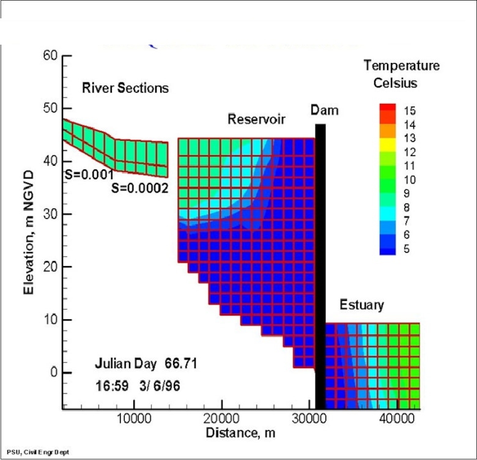

# CE-QUAL-W2

CE‐QUAL‐W2 (W2) is a two‐dimensional (2D), longitudinal/vertical, hydrodynamic and water quality (WQ) model. Since the model assumes lateral homogeneity, it is best suited for relatively long and narrow waterbodies exhibiting longitudinal and vertical water quality gradients. The model has been applied to rivers, lakes, reservoirs, estuaries and combinations thereof.  

|  |
|--|
| Longitudinal view of temperature output for a riverine section, a reservoir, and an estuary from a CE‐QUAL‐W2 model application. |

## Applications

* Selected as the reservoir WQ model of choice throughout the U.S. and many other countries
* Selected as the 2-D, longitudinal/vertical hydrodynamic and water quality model of choice for:
    * USACE
    * U.S. Geological Survey (USGS)
    * U.S. Department of the Interior, Bureau of Reclamation (USBR)
    * U.S. Environmental Protection Agency (U.S. EPA)
    * Tennessee Valley Authority (TVA)
* More than 300 applications worldwide
* Recent applications of W2 were developed for:
    * Columbia River System Operation (CRSO) Project - FY20
        * Columbia River
            * Grand Coulee Reservoir
            * Bonneville Lake
            * The Dalles Dam
            * Chief Joseph Dam
        * Snake River
            * Lower Granite Dam
            * Lower Monumental Dam
            * Little Goose Dam
            * Ice Harbor Dam
            * McNary Dam
        * Clearwater River
            * Dworshak Dam
    * Columbia River Treaty (CRT) - FY20
    * Applegate Lake – FY14
    * Lost Creek Lake – FY13
    * Tygart Reservoir and River FY13
    * Lehigh River FY12
    * Cougar Reservoir ‐ FY12
    * Clarion Reservoir FY09
    * Minnesota River ‐ FY08
* Cited in more than 15 PhD dissertations, 50 Master’s theses, more than 100 presentations at scientific meetings by numerous researchers, and in more than 20 journal articles by various researchers worldwide
* Portland State University reports that there are 3 - 4 model downloads per day (about 1,500 model downloads per year) from around the world and about 10 - 30 visitors to their web site per day (7,000 visitors per year).

## Version 4.5 Capabilities and Limitations

W2 includes variable density as affected by temperature, salinity, Total Dissolved Solids (TDS), and Total Suspended Solids (TSS) to simulate stratified flow. There are 28 water quality constituent state variables. Any combination of constituents can be included or excluded from a simulation. The effects of salinity or total dissolved solids/salinity on density and thus hydrodynamics are included only if they are simulated in the water quality module. The water quality algorithm is modular, allowing constituents to be easily added as additional subroutines. New features and enhancements in Version 4.5 include:

The current model release is Version 4.5. The model release includes executables, source codes, and examples for the model and preprocessor. There is also a stand-alone V4 GUI preprocessor as part of the download package. There is a post-processor for W2 model output used since the V3.7 model by the DSI, Inc. group and an Excel macro utility that aids the model user in writing out files compatible with CE-QUAL-W2.

### Model Capabilities

Longitudinal-vertical hydrodynamics and water quality in stratified and non-stratified systems, nutrients-dissolved oxygen-organic matter interactions, fish habitat, selective withdrawal from stratified reservoir outlets, hypolimnetic aeration, multiple algae, epiphyton/periphyton, zooplankton, macrophyte, CBOD, sediment diagenesis model, and generic water quality groups, internal dynamic pipe/culvert model, and hydraulic structures (weirs, spillways) algorithms. The hydraulic structures algorithms include submerged and two-way flow over submerged hydraulic structures as well as a dynamic shading algorithm based on topographic and vegetative cover.

### Model Limitations

Well-mixed in lateral direction (but can be used in a Quasi-3-D mode by use of additional model branches), hydrostatic assumption for vertical momentum equation.

## Points of Contact (POC)

* ERDC-EL: Dr. Todd Steissberg
* Portland State University (PSU): Dr. Zhonglong Zhang and Dr. Scott Wells
* LimnoTech, Inc.: Dr. Billy Johnson
